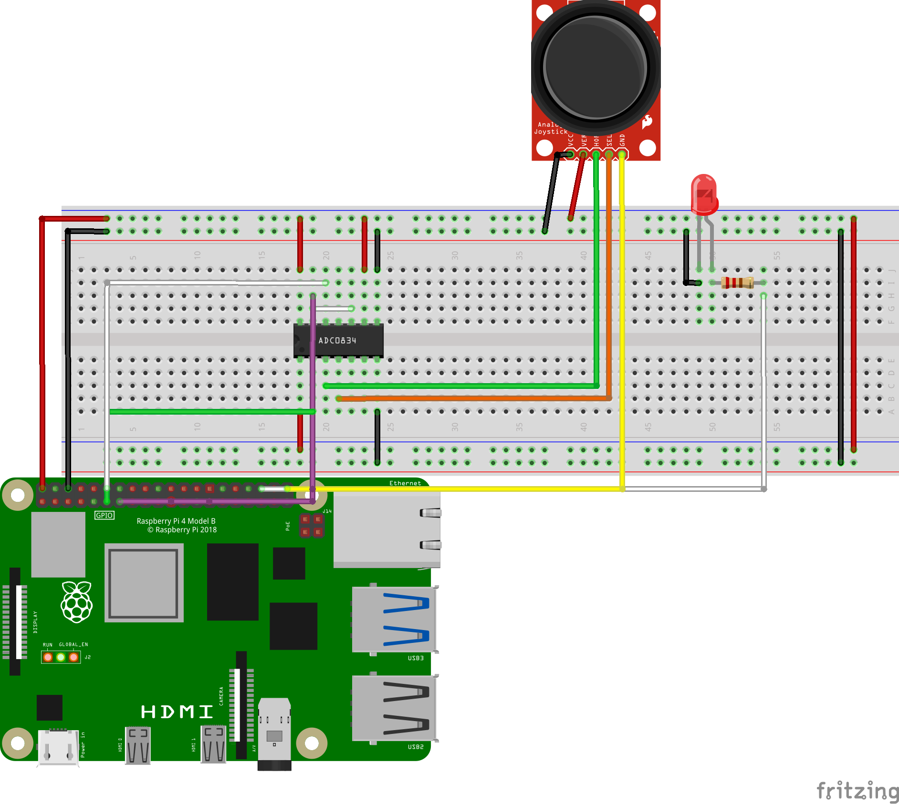

#  ジョイスティックによるLED制御（PWM＋トグル式スイッチ）

##  概要

このプロジェクトは、ジョイスティックとLED、ADC0834を使って、

- X軸のアナログ入力に応じてLEDの明るさをPWM制御
- ボタンスイッチでLEDのON/OFFをトグル切り替え

を行うRaspberry Pi向けの電子工作です。

---

##  動作仕様

- **X軸の入力値（0～255）**をPWMのデューティ比（0～100%）に変換
- ボタンスイッチを**押すたびにLEDのON/OFFが切り替わる**（トグル式）
- LEDがOFFのときはPWM出力を0%に

---

## デモ動画

[https://www.youtube.com/watch?v=HGOGifDt7rs]
---

##　参考資料

Raspberry Pi LESSON 18: Using a Joystick With the Raspberry Pi[https://www.youtube.com/watch?v=T6HsRRXBVS8]
---

##　回路図

----

## ライセンス
このプロジェクトの一部コードは SunFounder Da Vinci Kit に基づき、
GNU General Public License v2（またはそれ以降）の条件で公開されています。
詳細は LICENSE ファイルをご覧ください。

